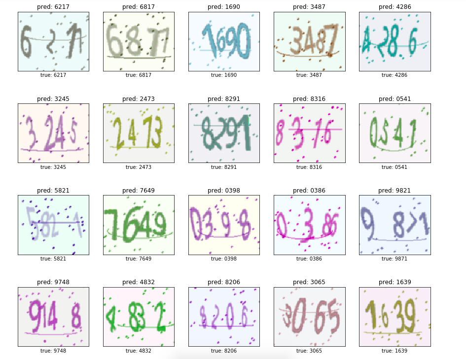
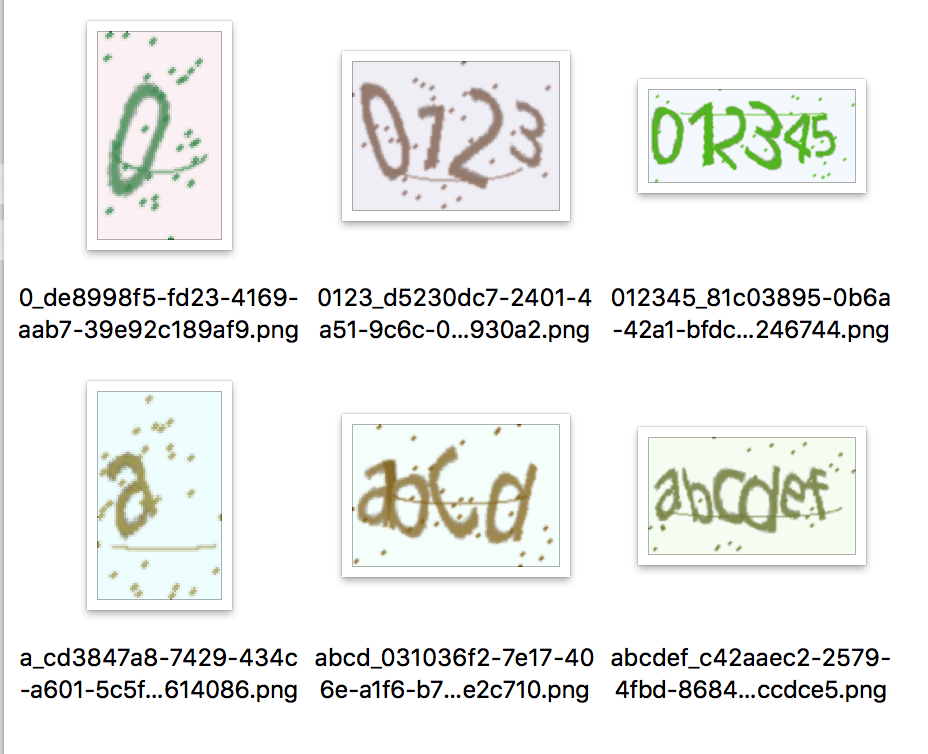

# Captcha Solving Using TensorFlow


## Introduction

1. Solve captcha using TensorFlow.
2. Learn CNN and TensorFlow by a practical project.

Follow the steps,
run the code,
and it works!

the accuracy of 4 digits version can be as high as 99.8%!

There are several more steps to put this prototype on production.


## Table of Contents

- Solve Captcha Using CNN Model

  - Training: 4-digits Captcha
  - Training: 4-letters Captcha
  - Inference: load trained model and predict given images

- Generate DataSet for Training

  - Usage
  - Example 1: 4 chars per captcha, use digits only
  - Example 2: sampling random images

## Solve Captcha Using CNN Model


old code that using tensorflow 1.x is moved to [tensorflow_v1](tensorflow_v1).


#### Training: 4-digits Captcha

this is a perfect project for beginers.

we will train a model of ~90% accuracy in 1 minute using one single GPU card (GTX 1080 or above).

if we increase the dataset by 10x, the accuracy increases to 98.8%.
we can further increase the accuracy to 99.8% using 1M traning images.

here is the source code and running logs: [captcha-solver-tf2-4digits-Net-98.8.ipynb](captcha-solver-tf2-4digits-Net-98.8.ipynb)

Images, Ground Truth and Predicted Values:

there is 1 predicton error out of the 20 examples below. 9871 -> 9821



Accuracy and Loss History:


Model Structure:

- 3 convolutional layers, followed by 2x2 max pooling layer each.
- 1 flatten layer
- 2 dense layer


#### Training: 4-letters Captcha

this is a more practical project.

the code is the same as the 4-digits version, but the training dataset is much bigger.

it costs 2-3 hours to generate training dataset and costs 30 min to train a 95% accuracy model.

here is the source code and running logs: [captcha-solver-tf2-4letters-Net.ipynb](captcha-solver-tf2-4letters-Net.ipynb)


#### Inference: load trained model and predict given images

example: [captcha-solver-model-restore.ipynb](captcha-solver-model-restore.ipynb)


## Generate DataSet for Training

#### Usage

```bash
$ python datasets/gen_captcha.py  -h
usage: gen_captcha.py [-h] [-n N] [-c C] [-t T] [-d] [-l] [-u] [--npi NPI] [--data_dir DATA_DIR]

optional arguments:
  -h, --help           show this help message and exit
  -n N                 epoch number of character permutations.
  -c C                 max count of images to generate. default unlimited
  -t T                 ratio of test dataset.
  -d, --digit          use digits in dataset.
  -l, --lower          use lowercase in dataset.
  -u, --upper          use uppercase in dataset.
  --npi NPI            number of characters per image.
  --data_dir DATA_DIR  where data will be saved.
```

examples:



#### Example 1: 4 chars per captcha, use digits only

1 epoch has `10*9*8*7=5040` images, generate 6 epoches for training.

generating the dataset:

```bash
$ python datasets/gen_captcha.py -d --npi=4 -n 6
10 choices: 0123456789
generating 6 epoches of captchas in ./images/char-4-epoch-6/train
generating 1 epoches of captchas in ./images/char-4-epoch-6/test
write meta info in ./images/char-4-epoch-6/meta.json
```

preview the dataset:

```bash
$ python datasets/base.py images/char-4-epoch-6/
========== Meta Info ==========
num_per_image: 4
label_choices: 0123456789
height: 100
width: 120
n_epoch: 6
label_size: 10
==============================
train images: (30240, 100, 120), labels: (30240, 40)
test images: (5040, 100, 120), labels: (5040, 40)
```

#### Example 2: sampling random images

scenario: use digits/upper cases, 4 chars per captcha image.

1 epoch will have `36*35*34*33=1.4M` images. the dataset is too big to debug.

using `-c 10000` param, sampling 10k *random* images.


